<div align="center">

# ◆ Lustre

**Gorgeous, configurable 3D charts for the web.**

*In mineralogy, "lustre" names the ways light plays on a surface — metallic, vitreous, adamantine.
This library brings those finishes to your data.*

[](https://mihaipanait.github.io/lustre-charts/)
[](https://www.npmjs.com/package/lustre-charts)
[](LICENSE)
[](https://threejs.org)
[](package.json)
[](#development)

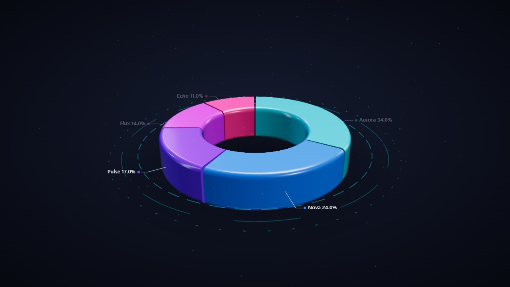

**[▶ Play with the live demo](https://mihaipanait.github.io/lustre-charts/)** — every material, palette and effect, right in your browser.

*Few chart types. Obsessive attention to how they look.*

</div>

---

Lustre is a small 3D charting library built on [three.js](https://threejs.org). It deliberately
ships **a few chart types with deep configurability and reference-grade visual quality**, rather
than fifty chart types that all look like homework:

- 🥧 **Pie / Donut** — revolved cross-section profiles (rounded, straight, pillow, tube… or your
  own points), pad angles, exploding slices, callout labels
- 📊 **Bar** — single or grouped series, rounded bars, projected value axis, staggered entrances

Everything else is *look and feel*:

| | |
|---|---|
| 🎨 **6 material presets** | `glossy` · `glass` · `metal` · `neon` · `hologram` · `matte` — physically based, tuned per theme, every parameter overridable |
| 🌗 **Themes** | `dark`, `light`, fully custom objects, transparent backgrounds |
| 🌈 **8 palettes** | aurora, neon, metal, candy, ocean, sunset, violet, mono — or any color array, auto-extended for large datasets |
| ✨ **Effects** | bloom post-processing, neon grid floor, HUD rings, floating particles, soft contact shadow |
| 🎬 **Motion** | sweep / rise / scale / wave / grow entrances, tweened data updates, hover lift & glow, click-to-explode |
| 🏷 **Overlays** | SVG callout labels (dot + elbow leader), frosted-glass tooltip, interactive legend with animated re-layout |
| ♻️ **Engineering** | render-on-demand loop, `ResizeObserver` responsive, PNG export, complete `destroy()`, zero dependencies beyond `three` |

## Gallery

| Glossy · light | Metal · light | Metal · dark |
|---|---|---|
| 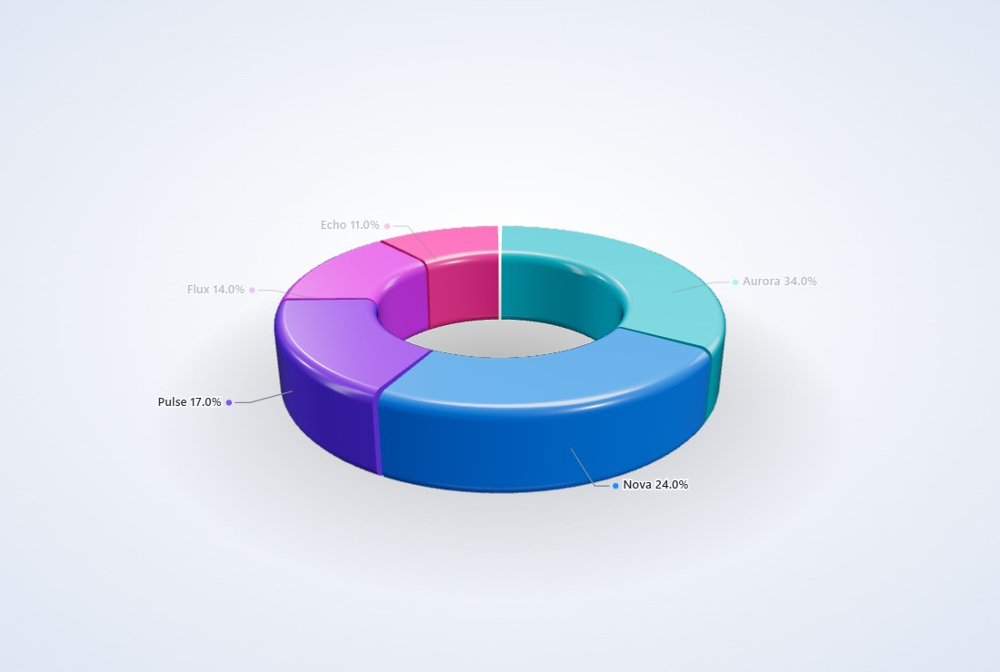 | 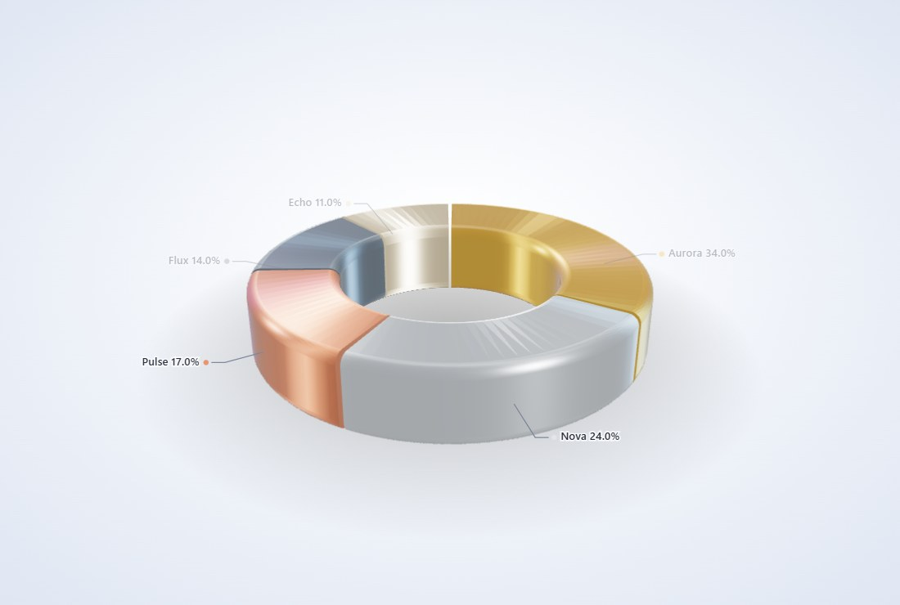 | 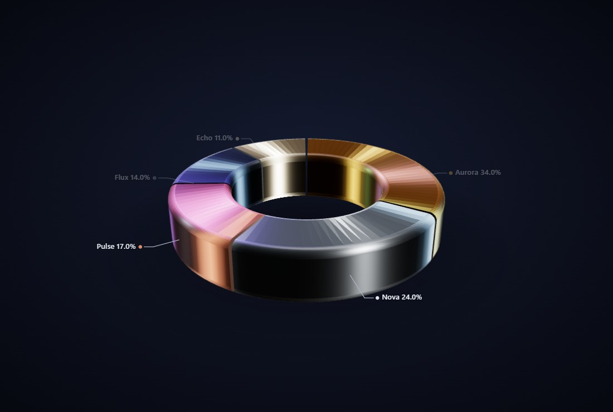 |

| Neon + grid + bloom | Neon bars | Glass · dark |
|---|---|---|
| 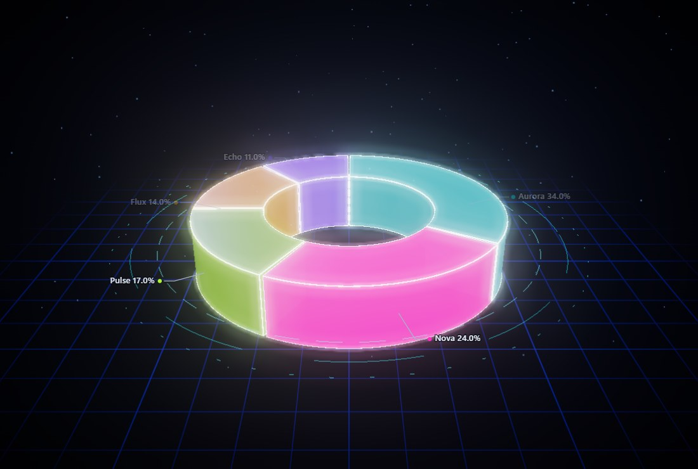 | 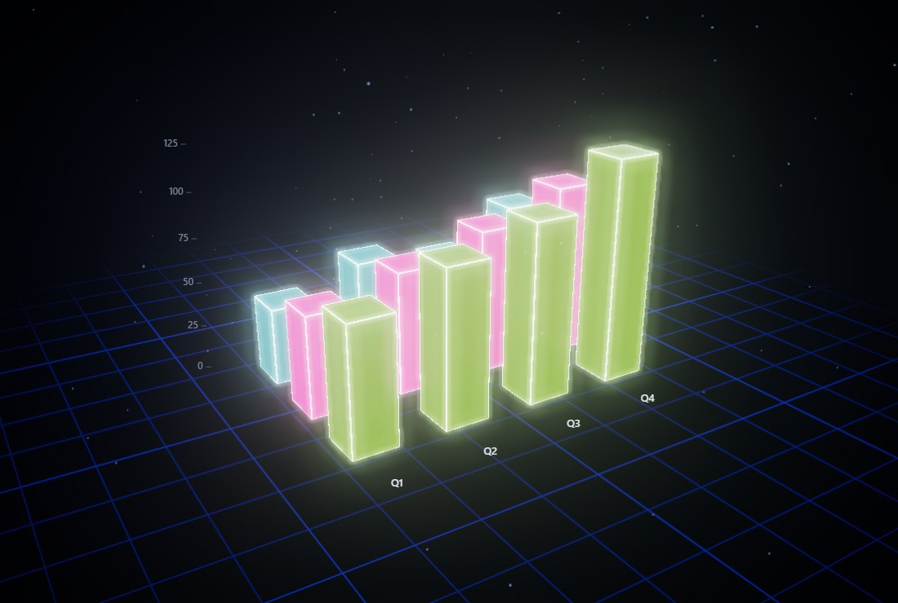 | 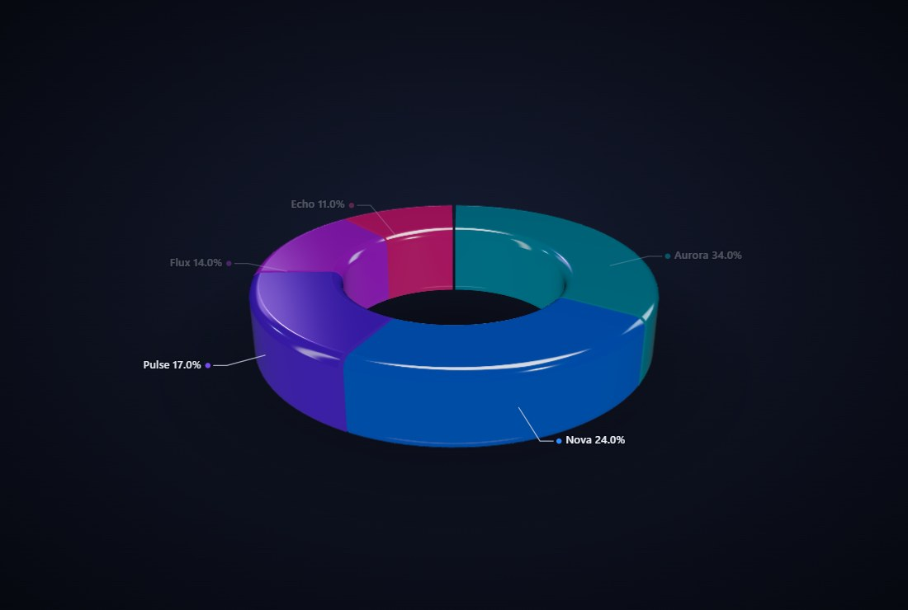 |

| `tube` profile | Custom profile (your own points!) | Click to explode |
|---|---|---|
| 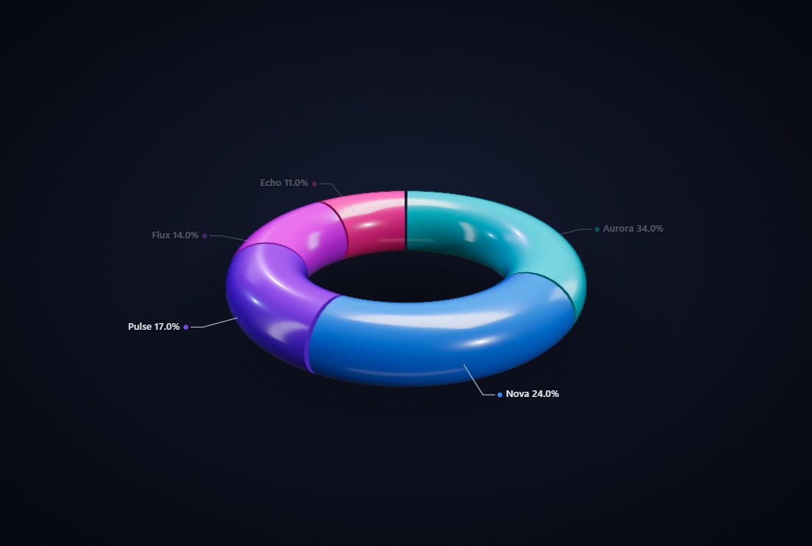 | 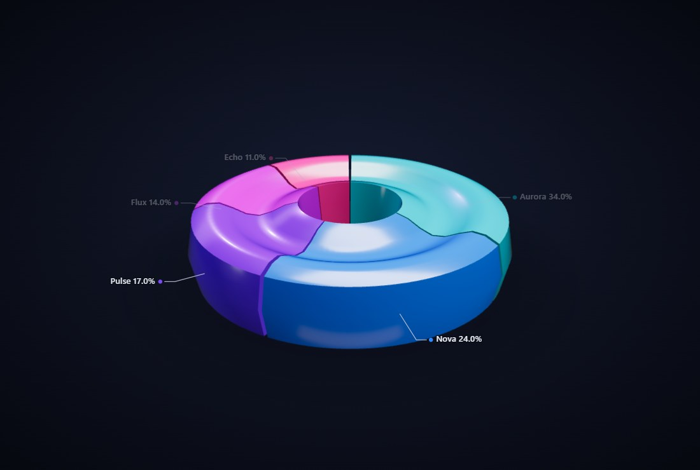 | 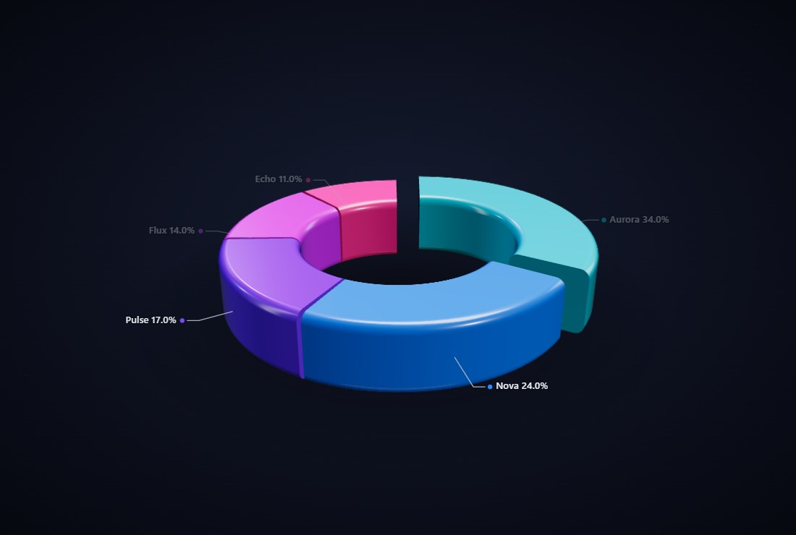 |

## Quick start

### npm

```bash
npm install lustre-charts three
```

```js
import { LustreChart } from 'lustre-charts';

const chart = new LustreChart('#app', {
  type: 'donut',
  data: [
    { label: 'Chrome', value: 64 },
    { label: 'Safari', value: 19 },
    { label: 'Edge', value: 9 },
    { label: 'Firefox', value: 8 },
  ],
  options: {
    theme: 'dark',
    material: 'glossy',
    palette: 'aurora',
  },
});
```

### No bundler? No problem

Lustre is plain ES modules — an import map is all you need:

```html
<div id="app" style="width:100%;height:480px"></div>

<script type="importmap">
{
  "imports": {
    "three": "https://cdn.jsdelivr.net/npm/three@0.170.0/build/three.module.js",
    "three/addons/": "https://cdn.jsdelivr.net/npm/three@0.170.0/examples/jsm/",
    "lustre-charts": "https://cdn.jsdelivr.net/npm/lustre-charts/src/index.js"
  }
}
</script>

<script type="module">
  import { LustreChart } from 'lustre-charts';
  new LustreChart('#app', { type: 'pie', data: [12, 19, 3, 5] });
</script>
```

## The fun parts

### Materials in one line

```js
options: { material: 'neon' }        // bloom auto-enables, rim lines appear
options: { material: 'metal', palette: 'metal' }   // brushed gold/silver/copper
options: { material: { preset: 'glass', roughness: 0.02, ior: 1.8 } } // override anything
```

### Cross-section profiles

The donut's cross-section is a first-class citizen. Use a preset…

```js
options: { pie: { profile: 'tube' } }   // torus-like, straight, rounded, pillow…
```

…or hand it your own 2D outline (`x` = radius, `y` = height) and Lustre revolves it, caps it
and lights it:

```js
options: {
  pie: {
    profile: [
      { x: 3.1, y: -0.5 }, { x: 3.25, y: 0 }, { x: 3.1, y: 0.5 },
      { x: 2.0, y: 0.62 }, { x: 1.2, y: 0.45 }, { x: 1.0, y: -0.5 },
    ],
  },
}
```

### Live updates

```js
chart.update({ data: newData });                  // tweened re-layout
chart.setTheme('light');                          // relights the scene
chart.applyOptions({ material: 'hologram' });     // hot-swap the look
chart.replay();                                   // run the entrance again
const png = chart.toDataURL();                    // export what you see
chart.destroy();                                  // leaves zero traces
```

### Events

```js
options: {
  interaction: {
    onHover: (item) => console.log(item),         // { label, value, percent, color… }
    onClick: (item) => {},
    onSelect: (selectedItems) => {},
  },
}
```

## Documentation

| | |
|---|---|
| [Getting started](docs/getting-started.md) | install, first chart, data formats |
| [Configuration reference](docs/configuration.md) | every option, annotated |
| [Materials & theming](docs/materials-and-theming.md) | presets, palettes, themes, effects, custom studio |
| [Pie & donut charts](docs/charts/pie.md) | profiles, explode, labels, sorting |
| [Bar charts](docs/charts/bar.md) | series, axis, entrances |

## Demo playground

**[▶ mihaipanait.github.io/lustre-charts](https://mihaipanait.github.io/lustre-charts/)** — hosted straight from this repo, nothing to install.

Or run it locally:

```bash
git clone https://github.com/mihaipanait/lustre-charts.git
cd lustre-charts
npm run dev            # → http://localhost:5173/demo/
```

The [demo](demo/) lets you flip through every chart type, material, palette, theme, profile and
effect — and generates the config snippet for whatever you build.

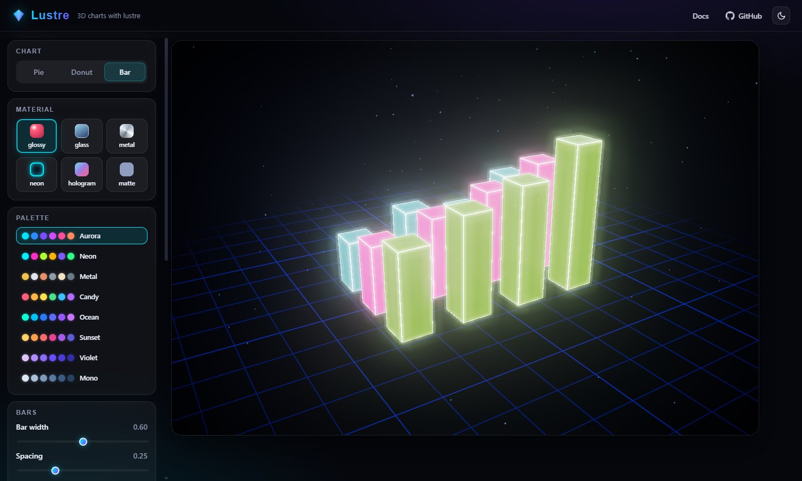

## Development

There is **no build step**. The library is modern ES modules in [`src/`](src/), loaded directly
by the demo via an import map. Edit, refresh, done. See [CONTRIBUTING.md](CONTRIBUTING.md).

```
src/
├── index.js          public API (LustreChart factory + exports)
├── core/             BaseChart rig · tween engine · themes · palettes · utils
├── charts/           PieChart · BarChart
├── geometry/         profile revolve + cap builder, outline builder
├── materials/        the six presets (physically based)
├── overlay/          SVG callout labels · tooltip · legend
└── fx/               studio environment · bloom · grid/rings/particles/shadow
```

> **Heads-up:** three.js prints a cosmetic `sigmaRadians … will clip` warning while
> pre-filtering the environment. It is harmless and comes from three's PMREM mip chain,
> not your code.

## Browser support

Any evergreen browser with WebGL2. `three >= 0.167` is a peer dependency.

## License

[MIT](LICENSE) © 2026 Mihai Panait

---

<div align="center">
<sub>Built with an unreasonable amount of care about specular highlights.</sub>
</div>
